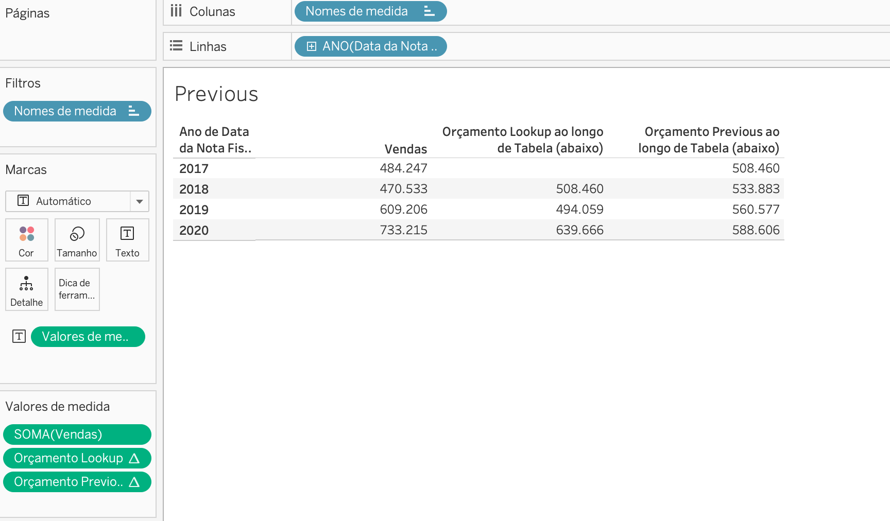

# Tableau_function
Functions and calculate in tableau


For this project I separated with some parts the first part I used function Look -> Superstore file

1 project 1 STEP: To create calculate field 

<table>
  <tr>
    <td align="center">
      <a href="#" title="Thales Farias">
        <br>
      </a>
    </td>
  </tr>
</table>

```
TOTAL (SUM([Vendas]))
SUM([Vendas])/TOTAL(SUM([Vendas]))
```


<table>
  <tr>
    <td align="center">
      <a href="#" title="Thales Farias">
        <br>
      </a>
    </td>
  </tr>
</table>

1 project 2 STEP: List purchases made in the last days of 2017 and associate them with the total purchases for December 2017.

-> Date need to be in days and discret.(change the configuration click in the date bottom)
-> Filter the date : Put "data nota fiscal"in filter and choice the date(in this example is december.

```
LOOKUP (MAX ( [Data da Nota Fiscal]),0)
Returns the most recent (maximum) invoice date within the current aggregation context

Date Difference
DATEDIFF( 'day', LOOKUP (MAX [Data da Nota Fiscal] ), 0) ,MAKEDATE (2017, 12, 31) )
DATEDIFF( 'day',LOOKUP(MAX [Data da Nota Fiscal] ), 0)-> Min
MAKEDATE (2017, 12, 31) )- > the date which you want to comparate

```

<table>
  <tr>
    <td align="center">
      <a href="#" title="Thales Farias">
        <br>
      </a>
    </td>
  </tr>
</table>

```
Put Look UP MAX in the filter and choose 0-1 filter to show just the last two days of purchases
```
<table>
  <tr>
    <td align="center">
      <a href="#" title="Thales Farias">
        <br>
      </a>
    </td>
  </tr>
</table>

```
The difference between the LOOKUP date and MAX date is that LOOKUP returns a value from a previous or future row based on the offset, while MAX date calculates the most recent date based on the current context of the data.
```

1 project 3  STEP—> Sales budget from 2017 onwards will always be greater than the previous year's budget.

```
Sales budget
LOOKUP (SUM (Vendas), -1) * 1.05
PREVIOUS_VALUE(sum([Vendas])) * 1.05
```


<table>
  <tr>
    <td align="center">
      <a href="#" title="Thales Farias">
        <br>
      </a>
    </td>
  </tr>
</table>

PREVIOUS_VALUE(SUM([Vendas])) * 1.05 starts with a base sales amount and adds 5%, continuing to add 5% to the previous value. This creates a cumulative growth effect over time, making it more suitable for long-term targets.

LOOKUP(SUM([Vendas]), -1) * 1.05 starts without any initial value but, from the second value onward, it takes the sales value from the previous row and adds 5%. Each subsequent calculation uses the sales value from the previous row as a reference and adds 5% to it.

### Adjustments and improvements.

The project is still under development, and the upcoming updates will focus on the following tasks:

- [x] Advanced courses about Tableau

The following tools were used in the construction of the project:

- [Tableau Public ](<https://public.tableau.com/app/discover/>)


## 🤝 Creator

<table>
  <tr>
    <td align="center">
      <a href="#" title="Thales Farias">
        <br>
        <sub>
          <b><a href="https://www.linkedin.com/in/thalesfreirefarias/" target="_blank">Thales Farias</b>
        </sub>
      </a>
    </td>
  </tr>
</table>


